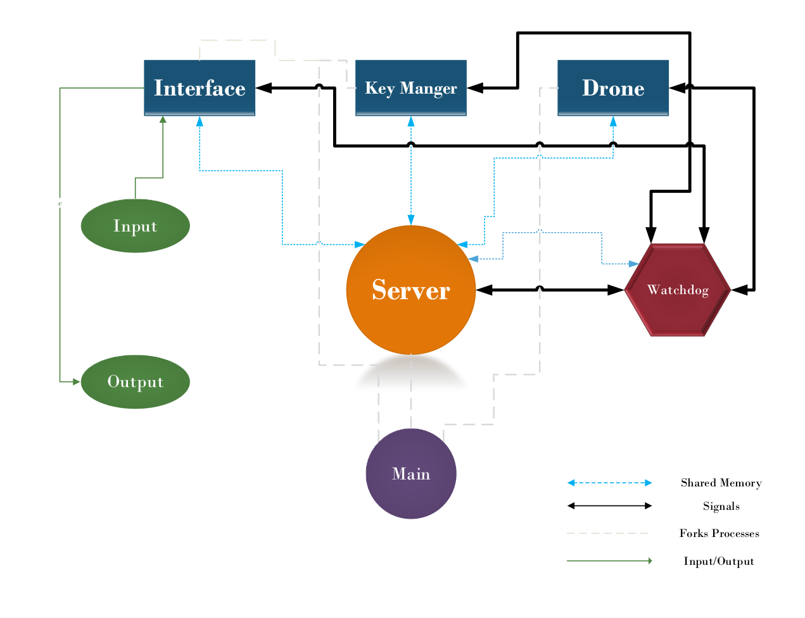

# Description
[Università degli studi di Genova](https://unige.it/en/ "University of Genova")

Professor: [Renato Zaccaria](renato.zaccaria@unige.it "Renato Zaccaria")

Student: [AmirMahdi Matin](https://github.com/amirmat98 "AmirMahdi Matin")  - 5884715 - Robotics Engineering

# Table of Contents


# ARP First Assignment - 20231202
Deadline: December 3, 2023, 12:59 pm.

After this date you can upload your work, but a penalty will be applied in the evaluation mark. 

The penalty is a percentage that monotonically increases from 0% up to 50% at the date of the next assignment's deadline.

 Follow these rules punctually and literally: no mercy for those who violate them 😈

All group member(s) upload only one archive file
No executables allowed
Update the groups list in the shared file so that the assignment can be put into relation with its authors.
Your work shall include (be both synthetic and complete):

sketch of the architecture
short definitions of all active components : what they do, which primitives used, which algorithms)
list of components, directories, files
makefile
instructions for installing and running
operational instructions
whatever else you think useful
What you upload cannot be substituted for no reason.

After submission, public your work on GITHUB.

# Assignment 1
TThis assignment constitutes the initial segment of the project for the Advanced and Robot Programming course at UniGe during the winter semester of 2023/2024.
The project was completed by AMIRMAHDI MATIN with the student ID 5884715.

## Installation & Usage
We utilized the `Makefile` for configuring the project.

To build executables, simply use the following command:

```
make
```
in the project directory.

To run the game hit:
```
make run
```
Upon occurrence of this event, five separate windows containing konsole processes will be initiated, with each window dedicated to a distinct section.

To remove the executables simply hit 
```
make clean
```

### Operational instructions, controls
To control the drone, utilize the following keybindings:

    `q` `w` `e` `r`
    `a` `s` `d`
    `z` ` ` `c`

Eight distinct directions of drone movement are represented by the provided bindings.
\.
`w` : UP
`s` : DOWN
`a` : LEFT
`d` : RIGHT
\.
`q` : UP-LEFT
`e` : UP-RIGHT
`z` : DOWN-LEFT
`c` : DOWN- RIGHT
\.
Utilizing the 'r' key in the core will halt all forces on the drone. However, due to the incorporation of inertia into the drone's physics programming, it will continue to move momentarily before coming to a complete halt.

## Overview 
The initial segment assumes the initial six components:
- Main
- Server (blackboard using Posix Shared Memory)
- Window (interface)
- Watchdog
- Drone
- Key Manager

All of the aforementioned components were fabricated.
Provide concise explanations of all active components, including their functions, the primitives they utilize, and the algorithms involved.



### Main
The main process is the ultimate progenitor of all processes. The software generates child processes through the use of the `fork()` function and executes them within a wrapper program called `Konsole`. This allows for the display of the current status and debugging messages until an additional thread/process is created specifically for collecting log messages.

Upon generating offspring, the process enters an infinite while loop, persistently awaiting the termination of all processes. Once this condition is met, the process proceeds to terminate itself.


### Server
The server process is the essential component of this project. This process generates all the components of the shared memory, including the segments and semaphores. It is also responsible for tidying them up when they are interrupted.

The server initializes semaphores and shared memory segments, and then starts an endless while loop, waiting for a signal from the watchdog. Upon exiting the loop (which is not expected to occur, as the current assumption is that the server only closes when stopped), it performs a cleanup of the segments and semaphores, ensuring that no remnants are left behind. 


### Watchdog
The role of a watchdog is to oversee the operational status of all processes, ensuring that they are currently active and have not been terminated.

During initialization, the PIDs of processes are retrieved from a designated shared memory segment. It is important to note that in the main process, which is running the wrapper process Konsole, it is not feasible to obtain the true PID using `fork()` in `main` at this stage.

Subsequently, the process enters a while loop, wherein it dispatches a `SIGUSR1` signal to all the processes to verify their liveness. They reply to the watchdog by sending a `SIGUSR2` signal, using the process ID obtained from `siginfo_t`. This resets the counter for program responses. When the counter for any of them hits the threshold, Watchdog triggers a `SIGINT` signal to all processes and terminates, ensuring the closure of all semaphores it was utilizing. A similar occurrence arises when Watchdog is disrupted.


### Interface (Window)
By establishing a graphical environment, the interface process is responsible for managing user interaction within the `Konsole` application software. This environment is intended to collect inputs from users, which are physically represented by key presses, and then display the most recent state of the application after receiving those inputs.

Initialization of the appropriate signals, shared memory, and semaphores is performed in order to launch this process. This creates the foundation for the execution of the process. For the purpose of managing both the input (the key that was pressed) and the output (the position of the drone), two shared memory addresses are utilized.

For the purpose of constructing the graphical user interface, the ncurses library is utilized. In the beginning, the program utilizes the `initscr()` function. Subsequently, the terminal dimensions are obtained by utilizing the `getmaxyx()` function. Finally, a box is drawn around the interface by utilizing the `box()` function. The initial position of the drone is established somewhere in the middle of this box, which serves as a representation of the boundaries of the functional region within which the drone is allowed to roam.

Subsequently, the application becomes trapped in an indefinite loop, continuously monitoring the key presses of the user with the assistance of the `getch()` function. Whenever a movement action occurs, it simultaneously updates the position of the drone on the screen by using the `mvaddch()` function. Consequently, this guarantees that the user can engage with the drone in real time and visualize its motions.

### Drone
Within the interface working area (box), the drone process is the one responsible for the physics of the drone, as well as its movement, bounds, and conditional events. It guarantees that the drone will operate appropriately and within a set of pre-defined parameters, which will be added to the list of upgrades in the future to include user-specific customization options. 

As was the case with the processes that came before it, the initialization of all signals, shared memory, and semaphores occurs first. The initial values of numerous variables, such as position, velocity, and force, are also provided. Additionally, multiple variables are defined. 

Other than the functions required for memory read/write and semaphores, the main loop does not make use of any special functions except for those necessities. There are two different approaches that are done in order to navigate the drone through the screen. The `step method`, which consisted of moving the drone one block (or step) at a time, was exclusively employed for the purpose of internal testing, and its selection is implemented through hard-coding. After that, we have the `differential_equations`, which is the default choice at the beginning of the program. This method contains the dynamic formulae for the drone, which cause the drone to move with inertia and viscous resistance.


### Key manager
It is the keyboard manager process that acts as the connection between the user interface and the computation of the movements of the drone. The key that was pressed by the user is retrieved from the shared memory, and then it is translated into integer values that indicate the force that was applied in each possible direction. These values are then conveyed to the procedure that is being carried out by the drone.

Controlling the iteration time within an endless while loop is accomplished by utilizing the `sem_wait()` function, which simultaneously synchronizes with the semaphore that is shared with the interface process. Several `if` statements are contained within a function that is responsible for determining the precise action that is to be taken. Based on these conditions, values are allocated to variables x or y, which represent movement along the horizontal or vertical axis within the window. These variables are used to represent movement. There are three possible values that are sent, which are `[-1, 0, 1]`. These values represent the quantity and direction of movement. Any other value that falls outside of this range would indicate a particular action that is not related to movement that is comprehended by the drone process.


### Additional Comments
- The watchdog obtains the process ID (PID) of all the processes through a shared memory section. For this procedure to be executed, three semaphores are necessary. (In the view of the writer, two would suffice, but currently we needed to secure the stability of the logical progression and did not have the opportunity to refine this solution.)

